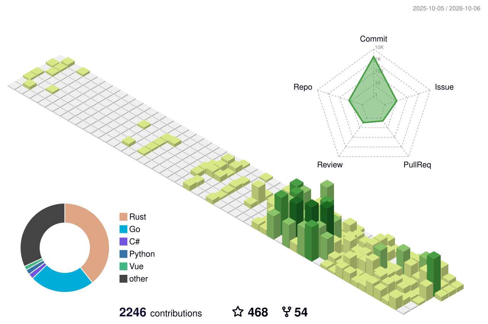

<!-- https://github.com/kyechan99/capsule-render -->

  

  

  

<!-- https://github.com/DenverCoder1/readme-typing-svg -->

  
  
  <!-- https://github.com/antonkomarev/github-profile-views-counter -->
  

<!-- 3D contributions: https://github.com/yoshi389111/github-profile-3d-contrib -->

  <picture>
    <source media="(prefers-color-scheme: dark)" srcset="./profile-3d-contrib/profile-night-rainbow.svg" />
    
  </picture>

<picture align="center">
  <source media="(prefers-color-scheme: dark)" srcset="https://raw.githubusercontent.com/Yuelioi/Yuelioi/output/github-snake-dark.svg" />
  <source media="(prefers-color-scheme: light)" srcset="https://raw.githubusercontent.com/Yuelioi/Yuelioi/output/github-snake.svg" />
  
</picture>

